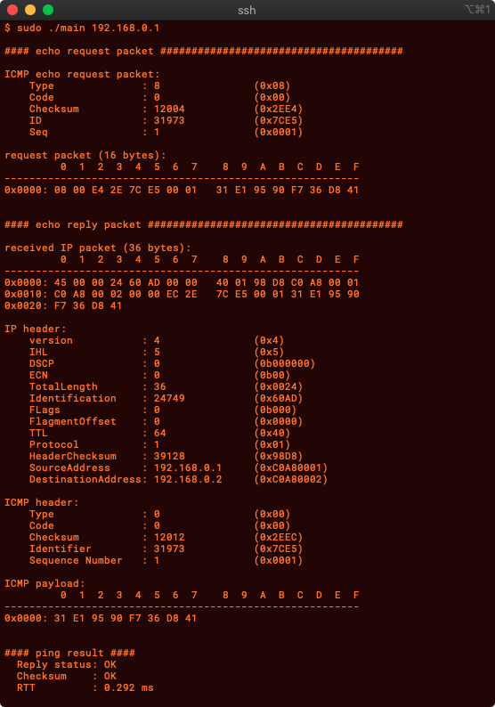

# Build & Run
## Build:
```
make
# or
nim c -o=ping main.nim
```  
  
## Run:
Using `rawsocket`, program **must** run in admin/root privileges.  
```
sudo ./ping <ip.adress.of.somewhere>
```

# Description

it will send a ICMP packet, and calculate round trip time.  
this code will not handle some timeout or packet error.  


  
that's it.
