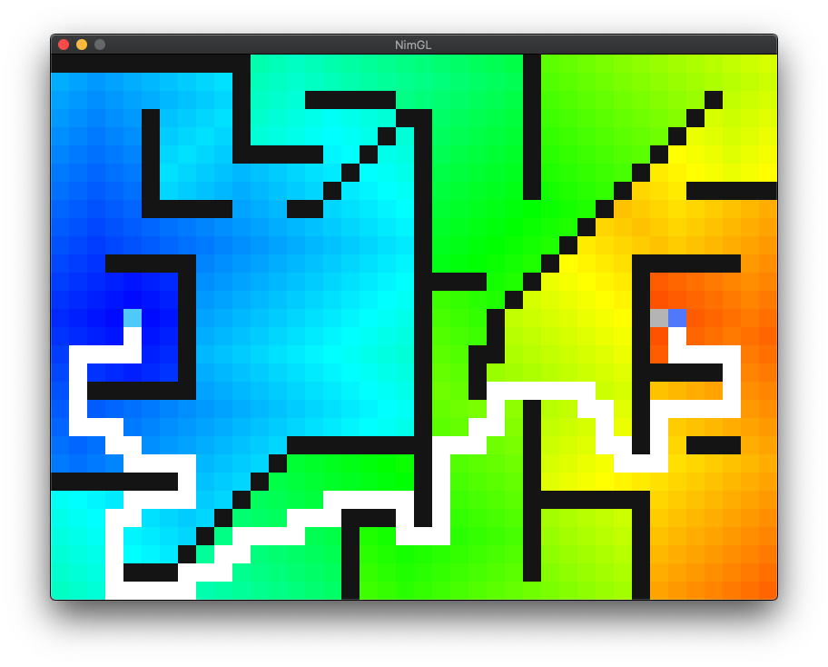

# Build & Run
## Build:
```
make
# or
nim c -o=dijkstra main.nim
```  
  
## Run:
```
./dijkstra
```

# Description

it will solve a path searching problem on grid map which has wall, start, and goal by dijkstra algorithm.



that's it.
